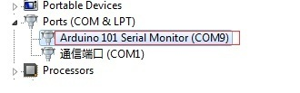
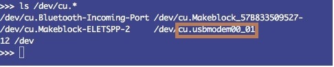
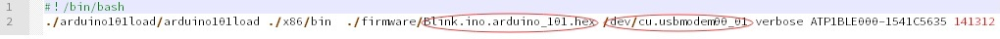
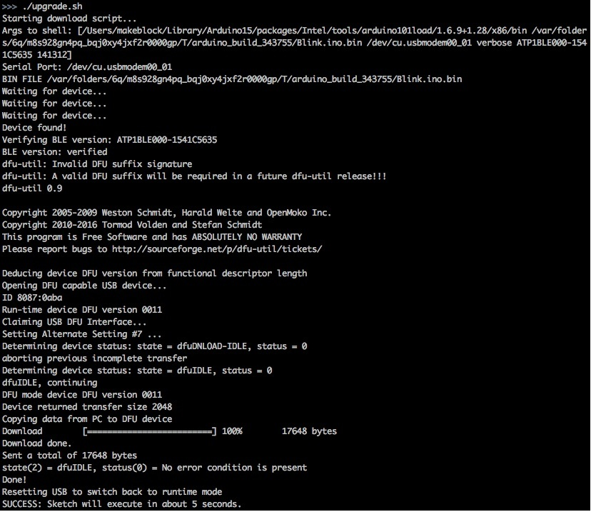

#  Driver installation #

## 1. On Windows ##

1. Double-click the file in path folder arduino101load\intel-arduino-tools-1.6.9-1.28-windows\post_install.bat

2. You may receive a prompt for user Account control, just allow it.

3. Then you will receive this prompt

             
4. Select [Always trust software from "Intel(R) Arduino 101], then click Install.

## 2. On MACOS ##

No need install drivers

#  Upgrade the firmware #

## 1. On Windows ##

1. Connect the arduino/Geduino 101 board to the PC using USB cable.
   
2. In the Device Manager, We can see The port display as follows        

3. Edit updateFirmware.bat, "arduino_101_firmware_A.hex" is the firmware HEX file name in firmware folder. "COM9" is the port read in step 2.

4. Double-click the file in path folder arduino101load\intel-arduino-tools-1.6.9-1.28-windows\updateFirmware.bat

5. You will see this interface

                                                     
6. Press the "MASTER RESET" button on the arduino/Genuino 101 board

7. You will see this interface if firmware upgrade successful.

## 2. On MACOS ##

1. Connect the arduino/Geduino 101 board to the PC using USB cable.

2. Open the terminal, and enter the command "ls /dev/cu.*", the arduino/Geduino 101 board is named like /dev/cu.usbmodemxxxx

3. Edit upgrade.sh, "Blink.ino.arduino_101.hex" is the firmware HEX file name in firmware folder. "/dev/cu.usbmodem00_01" is the port read in step 2.

4. Execute "upgrade.sh" in the directory of this file

5. You will see this interface

6. Press the "MASTER RESET" button on the arduino/Genuino 101 board
     
7. You will see this interface if firmware upgrade successful.

